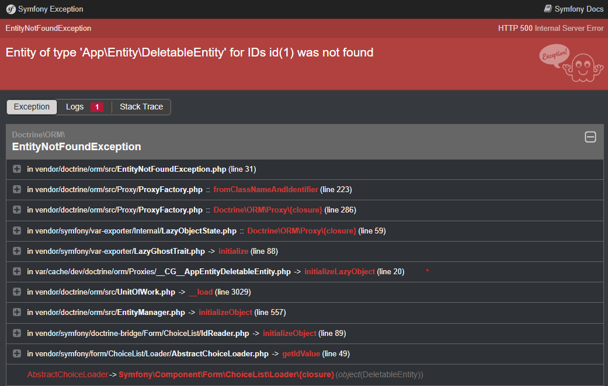
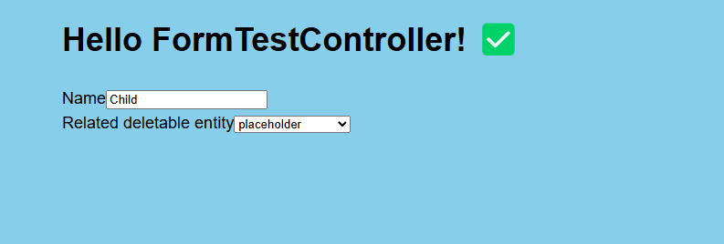

Symfony Form SoftDeleteAware EntityType
=======================================


The missing link between `softdeleteable` from [doctrine/extensions](https://github.com/doctrine-extensions/DoctrineExtensions) and Symfony Form component.

# Warning!

If you need to use this it most likely means that you have a bad architecture of your software. If you allow deletion or soft deletion you should first make sure
that each related entity is updated first with `null` or new relation. This form type is meant to be used for transition purposes in systems which need to quickly
add soft deletion on some entities which are used in relations, but due to time or other resources it is impossible to upgrade the actual processes.

## Purpose

If you are using the `softdeleteable` filter and `EntityType` forms you may encounter a situation when your CRUD Edit form in which the related entity is no longer
available as soft removed. This form type will make the form still properly render, but forcing the user to update the relation using the form.

In such situation, using standard entity type you may see a screen like this:



With the `SoftDeleteAwareEntityType` it will revert to the placeholder forcing user to update:



## Compatibility

* Symfony 6 or 7.
* Sonata Admin 3+

## Installation

First require it in your project:

```bash
composer require idct/symfony-form-soft-delete-aware-entity-type
```

As this is not a bundle register in your `services` (for example `services.yaml`) file:

If you have autowiring:
```yaml
    IDCT\SymfonyFormSoftDeleteAwareEntityType\SoftDeleteAwareEntityType: ~
```

If you do not use autowiring you need to pass doctrine as the first argument:

```yaml
    IDCT\SymfonyFormSoftDeleteAwareEntityType\SoftDeleteAwareEntityType:
        arguments:
            - '@doctrine'
```

Now in forms which use `EntityType` change the form type to `SoftDeleteAwareEntityType`. For example:

```php
class ParentFormType extends AbstractType
{
    public function buildForm(FormBuilderInterface $builder, array $options): void
    {
        $builder
            ->add('test', SoftDeleteAwareEntityType::class, [
                'class' => DummyEntity::class
            ])
        ;
    }
}
```

And that is all!

# Testing

Tool has a testing toolchain prepared using Docker. If you have docker installed simply run `./run-tests.sh`.

This will run unit tests with PHPUnit, generate code-coverage report and run some functional e-2-e tests using Behat and Chrome Driver.

# Contribution

Any contribution is more then welcome, please file any issues or pull requests, yet when possible please try to make sure that tests are working.